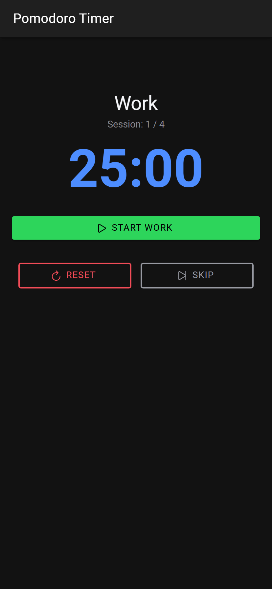
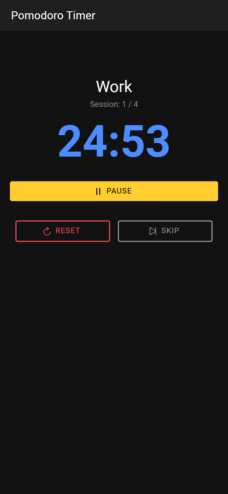
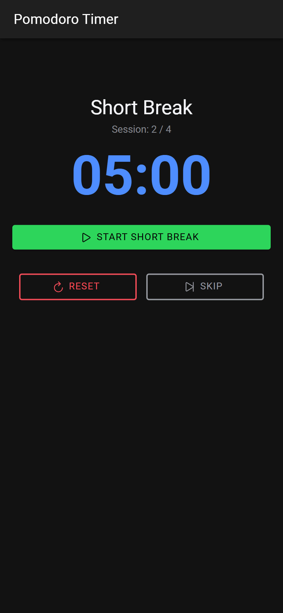
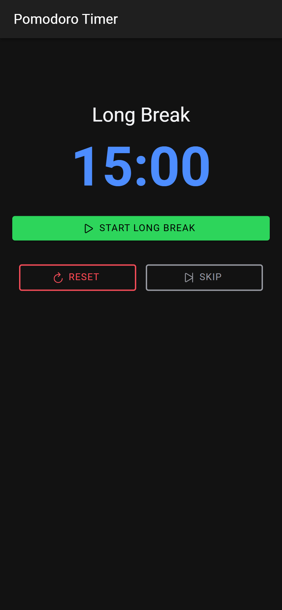

# Pomodoro Timer - Ionic Vue App (College Assignment)

## Introduction

This project is a simple Pomodoro Timer application built using the Ionic Framework with Vue.js. It aims to help users manage their work and break times effectively using the Pomodoro Technique. This application was developed as part of a college assignment.

The core functionality allows users to cycle through work sessions and short/long breaks with clear visual feedback and basic controls.

## Features

- **Standard Pomodoro Cycle:** Implements the traditional Pomodoro Technique with dedicated timers for:
  - Work Sessions (Default: 25 minutes)
  - Short Breaks (Default: 5 minutes)
  - Long Breaks (Default: 15 minutes, after 4 work sessions)
- **Timer Controls:**
  - Start: Begin the current work or break session.
  - Pause: Temporarily stop the timer.
  - Reset: Stop the timer and reset the entire Pomodoro cycle back to the first work session.
  - Skip: Immediately end the current session and move to the next one in the cycle.
- **Automatic Transitions:** Automatically switches to the appropriate break or work session when a timer completes.
- **Session Counter:** Visually tracks the number of completed work sessions to determine when a long break should occur.
- **Clean User Interface:** Simple and intuitive interface built with Ionic components.
- **(Placeholder)** Basic notification indication when a timer finishes (currently via `console.log`).

## Technology Stack

- **Framework:** [Ionic Framework](https://ionicframework.com/) (v6/v7 - Check your version)
- **UI Library:** [Vue.js](https://vuejs.org/) (v3) with Composition API (`<script setup>`)
- **Native Runtime (Optional):** [Capacitor](https://capacitorjs.com/)
- **Language:** TypeScript
- **Build Tool:** Vite
- **Styling:** CSS3 / SCSS (Ionic Theming)
- **Icons:** [Ionicons](https://ionic.io/ionicons)

## Getting Started

Follow these instructions to get a local copy up and running.

### Prerequisites

- **Node.js & npm:** Download and install from [nodejs.org](https://nodejs.org/)
- **Ionic CLI:** Install globally using npm:
  ```bash
  npm install -g @ionic/cli
  ```

### Installation & Running

1.  **Clone the repository:**

    ```bash
    # Replace YOUR_REPO_URL with the actual URL if you host it on GitHub/GitLab etc.
    git clone YOUR_REPO_URL
    cd pomodoroApp
    ```

    _Alternatively, if you are just submitting the code folder, navigate into the `pomodoroApp` directory._

2.  **Install Dependencies:**

    ```bash
    npm install
    ```

3.  **Run the app in the browser:**
    ```bash
    ionic serve
    ```
    This will open the app in your default browser, usually at `http://localhost:8100`. The app supports hot-reloading for development.

### Building the App (Optional)

- **Build for Web (Progressive Web App):**

  ```bash
  ionic build --prod
  ```

  The production-ready files will be in the `dist/` folder (or `www/` depending on Ionic version/config).

- **Add Native Platforms (iOS/Android):**

  ```bash
  # Add Android platform
  npx cap add android

  # Add iOS platform (requires macOS and Xcode)
  npx cap add ios
  ```

- **Sync Web Code with Native Platforms:**

  ```bash
  npx cap sync
  ```

- **Open Native IDE:**

  ```bash
  # Open in Android Studio
  npx cap open android

  # Open in Xcode
  npx cap open ios
  ```

## Usage

1.  The app opens to the **Work** timer, ready to start.
2.  Click **Start Work** to begin the 25-minute countdown.
3.  While running, you can click **Pause** to stop the timer or **Skip** to end the work session early and move to the break.
4.  When the work timer finishes (or is skipped), the app automatically transitions to a **Short Break** (5 minutes) and pauses. The session counter increments.
5.  Click **Start Short Break** to begin the break timer. You can Pause or Skip the break as well.
6.  After the break finishes (or is skipped), the app transitions back to **Work** and pauses.
7.  This cycle repeats. After 4 work sessions are completed, the next break will be a **Long Break** (15 minutes).
8.  After the Long Break, the cycle resets (session count goes to 0), and the next phase is **Work**.
9.  At any time, click **Reset Cycle** to stop the current timer and return to the initial **Work** state with the session count at 0.

## Screenshots

**1. Main Timer View (Work Session Ready)**


**2. Timer Running (Pause Visible)**


**3. Short Break View**


**4. Long Break View**

